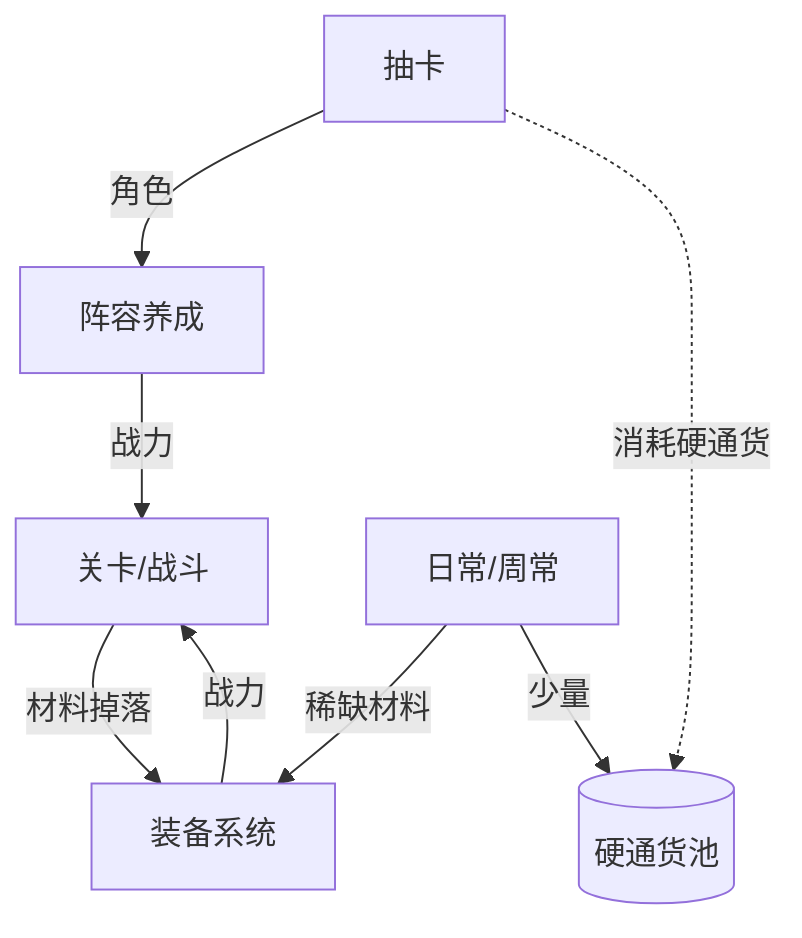
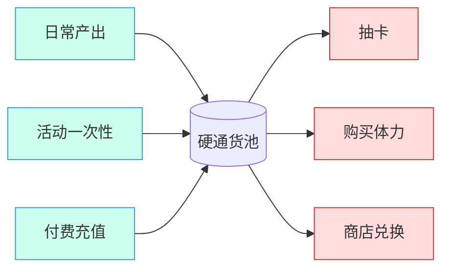
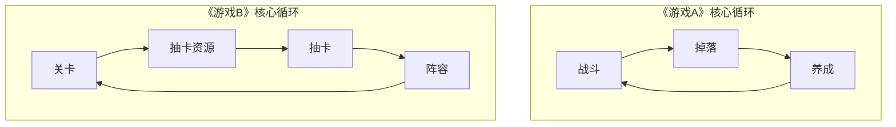

# Mermaid 图模板

核心循环图（闭环锚点）已在 SKILL.md 正文给出，**每份拆解必画**。本文件收录更复杂的三张图——按需取用，能直接暴露结构问题的图远胜一段文字描述。

Markdown 里的 mermaid 在 GitHub / Typora / Obsidian / VS Code 预览都能直接渲染，放进作品集别人点开即见流程图，无需额外截图。

---

## 一、系统依赖图（谁产出喂给谁消耗）

用 `graph TD`，箭头**标上流动的资源/动力**。这张图的价值在于一眼看出经济闭环、系统咬合与卡点。

````

````

画法要点：
- 实线箭头表示"产出/供给"，虚线（`-.->`）可表示"消耗/付费流出"，自行约定并在图注说明。
- 用 `[(...)]` 圆柱节点表示"资源池/储量"，与"系统/活动"节点区分开。
- 把**刻意稀缺的关键资源**画在显眼位置——它通常是付费墙和长线动力的命门。

---

## 二、资源水池图（产出口 → 池 → 消耗口）

把一种关键资源画成水池，左侧产出口（faucet）、中间储量（pool）、右侧消耗口（sink）。直观展示该资源是否易囤积、稀缺被卡在哪。

````

````

配合 `numerical-and-economy.md` 的产出-消耗表使用：图给直觉，表给结构。追问"哪个消耗口是刻意做大的、哪个产出口被刻意做小"，就找到了经济设计的意图。

---

## 三、竞品结构对比图（同维度横向并置）

竞品对比时，用子图（`subgraph`）把 2–3 款游戏的同一结构并排画出，差异一眼可见。例：对比三款游戏的核心循环长度/复杂度。

````

````

要点：并置不是为了评高下，而是让"循环长短、咬合多寡、卡点位置"的设计取舍可视化，配合 `comparison.md` 的定性结论使用。

---

## 通用提醒

- 节点文字简短，复杂说明放图外正文，别把图塞满。
- 中文节点名在多数渲染器正常，但若担心兼容可用英文/拼音节点 ID + 中文 label（如 `atk[战斗]`）。
- 图是为"暴露结构"服务的——画完问自己：这张图有没有让读者看到文字说不清的东西？没有就别放。
