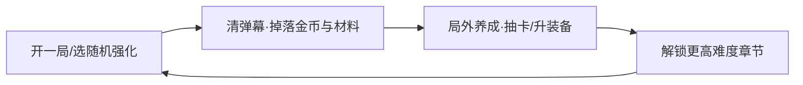
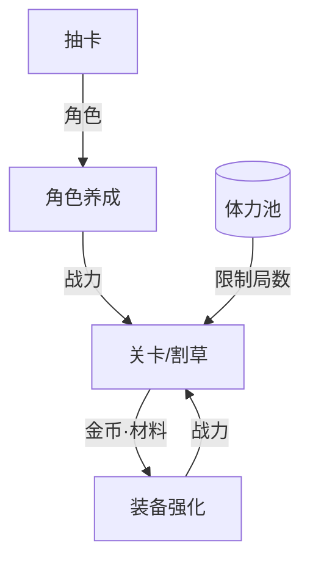

# 样例：一篇完整迷你拆解（示意用）

> **这是教学样例，不是真实游戏。** 下面的《弹幕方舟》为虚构游戏，用来一次性示范**结构怎么串、事实/推断怎么标、mermaid 密度多大、语气什么样**。本样例为压缩版（约 1200 字）；真实的全面拆解（full）应在 2000–4000 字。样例里【事实】指"游戏内可直接观察"，真实拆解时每条【事实】要对应真实来源。
>
> 拿它当模子：照着这个**骨架顺序、句子的"现象→意图→可学之处"节奏、图的简洁度**写自己的拆解即可。

---

# 《弹幕方舟》拆解报告
> 1.4 版 · iOS/安卓 · 全面拆解 · quick→full 示意 · 2026-06-06

## 一、速览（30 秒结论）
一款"幸存者like（割草）+ 抽卡养成"的 F2P 手游：局内 3 分钟自动走位、手动放技能清弹幕，局外靠抽角色和装备变强。**用 Roguelite 的局内爽感做皮，内核是二游式的长线养成与抽卡变现**。最值得学的一点：它把"单局随机构筑"和"局外固定养成"分成两套节奏，互相喂养又互不稀释。

## 二、核心循环

短循环（单局 3–5 分钟）靠**随机强化三选一**制造每局不同的 build 快感【事实】；中循环（每日）靠体力把局数锁在固定区间【推断：恢复速度卡在"想多打一两局就差一点"】；长循环（赛季）靠章节难度墙驱动养成。

## 三、系统结构

"关卡"是唯一产出口，喂给装备和角色两条养成线，两条线又都把战力还给关卡——闭环清晰。体力是刻意的节流阀【推断】，把免费玩家每天的产出卡在固定上限。

## 四、设计支柱
1. **局内随机构筑的爽感**（抽掉它就只剩枯燥刷数值）——这是留住人的钩子。
2. **局外双养成线的吃量**（角色线 + 装备线）——这是变现的深水区。
支柱在①②，所以下面重点拆这两块，其余（题材、表现层）略写。

## 五、商业化（挂载块·支柱②所在）
付费点地图：抽卡（角色/武器双池）、月卡、赛季通行证、体力直购。付费深度分层【推断】：免费玩家被"角色满命/满装备"的长线目标吊着；中 R 主要买通行证+月卡的性价比；大 R 吃"限定角色复刻+满命"。付费墙设在**第 7 章难度跳点**附近【推断：紧挨长线目标，制造"再强一点就过了"的冲动】——具体数值未公开，仅从体验推断量级。〔可学：把付费墙贴在情绪高点前一格，比直接卖数值的转化更自然。〕

## 六、总结与启发
做对了什么：用 Roguelite 局内体验解决了二游"养成枯燥、上线就挂机"的痛点，让每天的体力局**本身好玩**，而不只是领奖励。取舍：局内随机性强，对追求确定性养成的硬核氪佬不够友好。
- **可迁移**：任何长线养成产品，都可以问一句"玩家每天必做的那件事本身爽不爽"——把日常从'领奖励'升级成'有变数的玩法'，能显著抬高活跃质量。
- **如果我来做**：第 7 章那道墙离新手期偏近，可能在黏性未稳时劝退非付费用户；我会把第一道硬墙后移两章，用更平滑的难度换更高次留——代价是大 R 的付费冲动点也随之后移，需要用别的钩子补上。（任何修改都有代价，这点要讲出来。）

## 附：信息来源与不确定项
- **已验证事实**：局内三选一强化、双抽卡池、体力系统、章节难度递进（均游戏内可观察）。
- **推断依据**：付费墙位置——第 7 章是社区公认的卡点 + 该处礼包推送变密（两信号叠加）。
- **未确认假设**：各付费层占比、抽卡期望成本——官方未公开，仅量级推断。
- **待补信息**：真实流水分层、第 7 章具体数值曲线。
- **来源与访问日期**：（虚构样例，此处真实拆解应列 TapTap/点点数据/官方公告等 + YYYY-MM-DD）。
